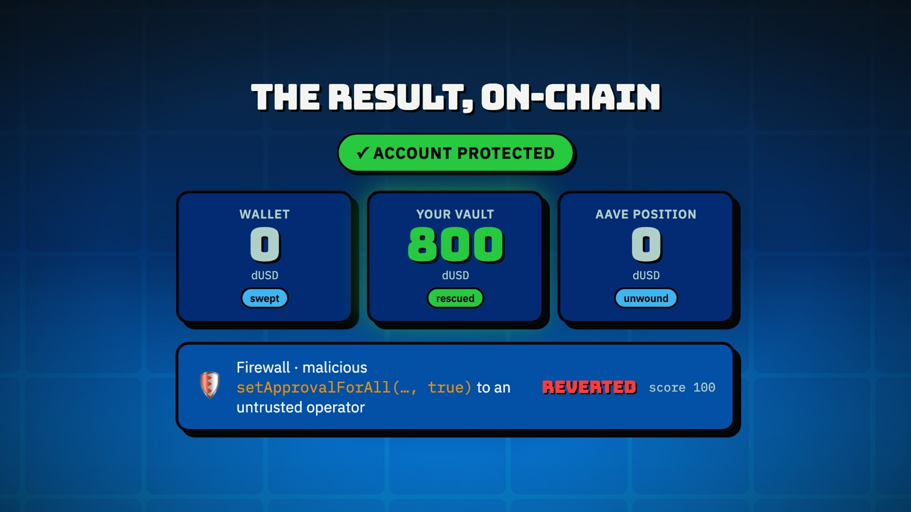
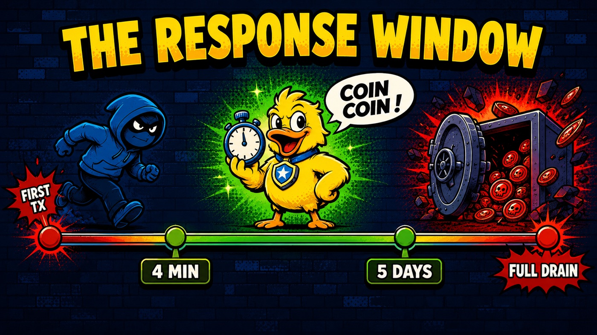
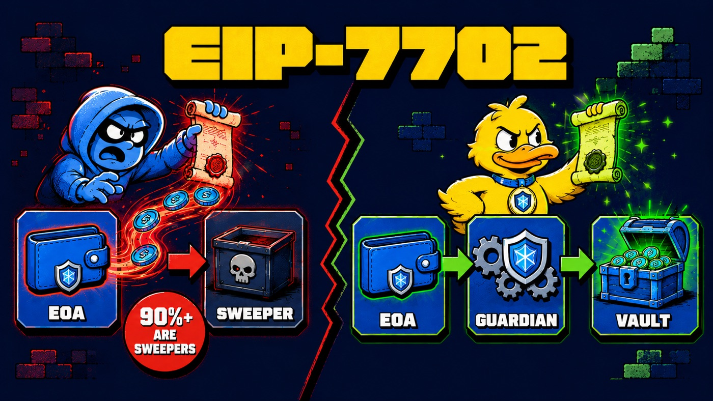
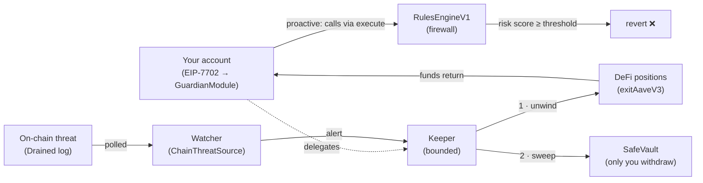
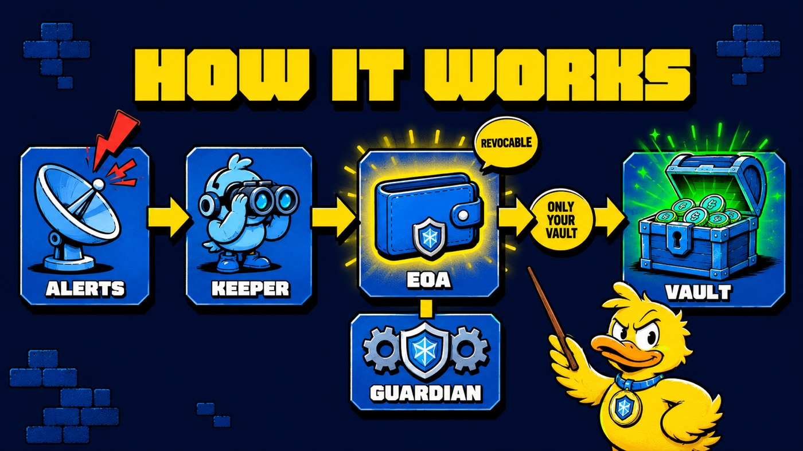
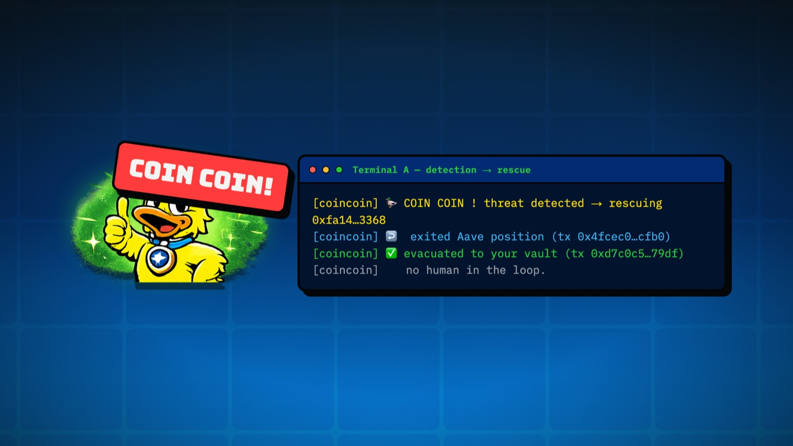
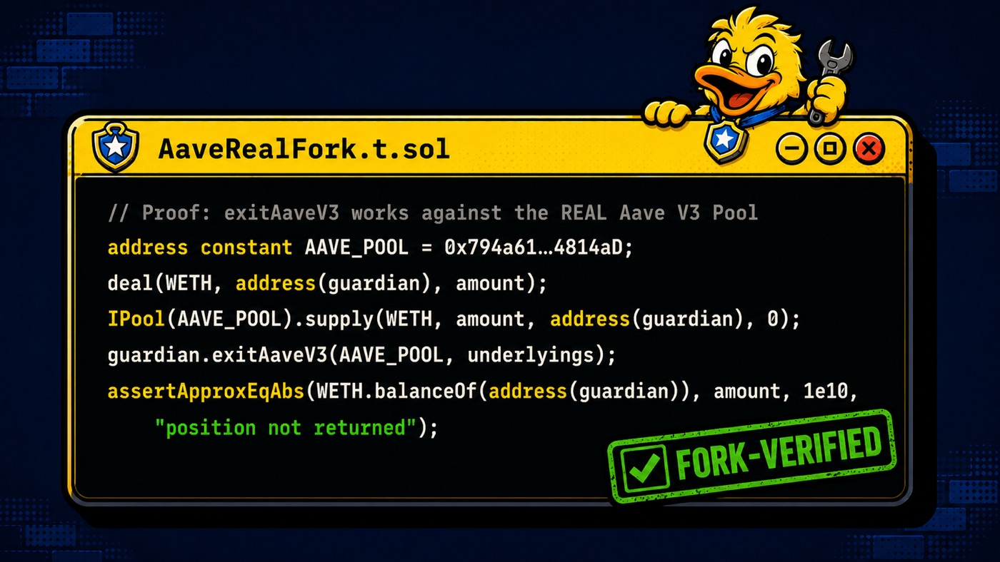

<div align="center">


# coincoin

### The self-custodial onchain firewall that quacks before you get drained — and moves your funds to safety on its own.

[](LICENSE)
[](contracts/)
[](https://getfoundry.sh)
[](#-testing)
[-F5D90A?style=flat-square)](#-live-deployment--proof)
[](#-security--trust-model)

**[▶ Live demo](https://coincoin-five.vercel.app/)** · **[How it works](#-how-it-works)** · **[Live deployment](#-live-deployment--proof)** · **[Quickstart](#-quickstart)** · **[Security](#-security--trust-model)** · **[Roadmap](#-roadmap)**

<br/>



</div>

---

## 🦆 What is coincoin?

Most wallet protection stops at the signature. **coincoin protects you *after* a compromise** — and protects the funds you've already deposited in DeFi, not just what's sitting in your wallet.

You delegate your account to a guardian via **EIP-7702**. A watcher reads real on-chain threat signals; the instant a verifiable exploit fires, a **bounded keeper** unwinds your DeFi positions and sweeps every token to a **vault only you can withdraw from** — inside the reaction window that non-atomic hacks leave open. You keep your keys the whole time; the keeper can *only* send to your own vault, and you can revoke in one transaction.

It's the same EIP-7702 primitive attackers use to drain wallets — turned into defense.

> Built for the **[Arbitrum Open House London](https://arbitrum-london.hackquest.io/)** Online Buildathon (May–June 2026), on the **Robinhood Chain** track.

---

## ⚠️ Status — honest "live vs. built"

coincoin is an **experimental, unaudited testnet project**. Do not use it with funds you can't lose. Here's exactly what runs where:

| | What | Where |
|---|---|---|
| ✅ **Live on-chain** | EIP-7702 delegation + self-config · ERC-20 sweep · approval revocation · **frozen vault** · **signed multi-keeper policy** (EIP-712) · **local firewall** (`RulesEngineV1`) · `exitAaveV3` DeFi exit | Robinhood Chain testnet (46630) |
| ✅ **Proven end-to-end** | Real **detection → Aave exit → evacuation** run on-chain — funds at rest *and* a deposited position rescued to the user's vault, no human in the loop | Robinhood Chain testnet (46630) |
| ✅ **Fork-verified** | The `exitAaveV3` code unwinds a real position against the **live Aave V3 Pool** (forked) | Arbitrum One (test fork) |
| 🟡 **Mocked in the live demo** | Aave V3 isn't deployed on Robinhood Chain, so the live exit runs against a `MockAavePool` stand-in | — |
| 🔭 **Roadmap** | Production integrations against live Aave V3 / GMX V2 on a network where they're deployed · broader firewall rules · security audit ([full roadmap](#-roadmap)) | — |

---

## 🕳️ The problem



- **$83.85M stolen from 106,106 victims** in 2025 via wallet drainers & phishing ([Scam Sniffer](https://www.scamsniffer.io/)). Attackers now weaponize **EIP-7702 itself** — 90%+ of onchain 7702 delegations are sweepers.
- On the protocol side, most exploits are **non-atomic**: the gap between the first malicious transaction and the full drain ranges from **4 minutes to 5 days** (Defimon). Nobody tools that window on the *user* side.
- Pre-signature tools (Blockaid, Revoke.cash) block a *bad signature* — but do nothing **after a compromise**, and nothing **for your DeFi positions**.

**Harpie** pioneered post-compromise protection but shut down in 2025; it relied on fragile front-run racing and never covered deposited positions. coincoin enforces at the account level (a primitive that arrived *after* Harpie) and covers DeFi — the blind spot.

---

## 🔭 How it works





1. **Onboard once.** Your EOA signs an EIP-7702 authorization delegating to `GuardianModule`, and self-configures its policy: the safe vault (frozen on first set) and an authorized keeper set.
2. **Watch.** The watcher daemon polls real `Drained` logs on-chain (zero external dependency). Calm until a verifiable threat appears.
3. **React.** On a threat, the keeper — which **cannot** do anything except evacuate to *your* vault — exits your DeFi positions (`exitAaveV3`), then sweeps every token to the `SafeVault`.
4. **Firewall (proactive).** Calls routed through `execute()` are scored by the stateless `RulesEngine`; malicious approvals (`approve` / `permit` / `setApprovalForAll` to an untrusted spender) revert at the account level before they ever land.

<div align="center"></div>

---

## 🛰️ Live deployment & proof

Everything below is live on **Robinhood Chain testnet (chain `46630`)** — [block explorer](https://explorer.testnet.chain.robinhood.com/). Full records in [`deployments/robinhood-testnet.json`](deployments/robinhood-testnet.json).

| Contract | Address |
|---|---|
| **GuardianModule** (EIP-7702 guardian) | [`0xd0d301Aeaa7AA5Ced16C927030f131c9Cb083b77`](https://explorer.testnet.chain.robinhood.com/address/0xd0d301Aeaa7AA5Ced16C927030f131c9Cb083b77) |
| **RulesEngineV1** (firewall) | [`0xc20A9d7D38B07a9C74A1fD87A2e25CA1973Cbc52`](https://explorer.testnet.chain.robinhood.com/address/0xc20A9d7D38B07a9C74A1fD87A2e25CA1973Cbc52) |
| **SafeVault** (demo) | [`0x49be3DC48fC0540346A064fCC6Fc94FBaE62f479`](https://explorer.testnet.chain.robinhood.com/address/0x49be3DC48fC0540346A064fCC6Fc94FBaE62f479) |

> The `GuardianModule` was also initially deployed (and **Arbiscan-verified**) on Arbitrum Sepolia at [`0x6671…200F`](https://sepolia.arbiscan.io/address/0x6671b4B73b79c284A710B00ef777d8E65f55200F).

<div align="center"></div>

**End-to-end rescue, run on-chain:** a victim account holding **500 dUSD idle + 300 dUSD deposited in Aave** is drained-adjacent → the watcher detects the exploit, exits the Aave position, and evacuates everything to the vault. Final state: **wallet `0`, vault `800`, Aave position `0`** — one keeper-driven sequence, no human in the loop.

🔗 **[Live site & dashboard →](https://coincoin-five.vercel.app/)** (connect an account at `/app` to inspect its protection status).

---

## 🚀 Quickstart

Reproduce the detection → evacuation demo end-to-end on Robinhood Chain testnet.

**Prerequisites:** [Foundry](https://getfoundry.sh), Node ≥ 22, [pnpm](https://pnpm.io), and a funded testnet wallet.

```bash
# 1. Clone + install
git clone https://github.com/gamween/coincoin.git
cd coincoin
cp .env.example .env          # fill in RPC + disposable testnet keys (see .env.example)

# 2. Contracts — build & test (90 tests)
cd contracts && forge test    # set ARBITRUM_ONE_RPC to also run the live-Aave fork
                              # deploy: see watcher/README.md → Deployment

# 3. Watcher — the product (run each in its own terminal)
cd ../watcher && pnpm install
pnpm onboard                  # one-time: EIP-7702 delegation + policy config
pnpm watch                    # 👁️  the guardian, watching real on-chain logs
pnpm exploit                  # 💥 (separate terminal) replay an exploit → real Drained log
#                             → watch prints "🦆 COIN COIN !" and evacuates to the vault
pnpm revoke                   # remove the delegation in one tx (100% non-custodial)
```

> ⚠️ **Never commit secrets.** `.env` is gitignored — only `.env.example` ships. Use **disposable testnet keys only**.

---

## 📁 Repository structure

```
coincoin/
├── contracts/      # Foundry — GuardianModule (EIP-7702), RulesEngineV1, SafeVault, mocks, deploy scripts
├── watcher/        # TypeScript/viem detection→rescue daemon (onboard · watch · exploit · revoke)
├── site/           # Vite/React/Tailwind landing page + /app dashboard
├── video/          # Remotion pitch + demo videos (code → MP4)
├── deployments/    # On-chain address records (robinhood-testnet.json, arbitrum-sepolia.json)
├── docs/           # Brand kit (BRAND.md), specs, submission guide, README assets
├── .env.example    # Config template (RPC, disposable keys, demo addresses)
└── LICENSE         # MIT
```

---

## 🔒 Security & trust model

coincoin is **non-custodial by construction**, but it is **experimental and unaudited** — treat it as a research prototype on testnet.

**Trust assumptions & guarantees**
- **You keep your keys.** The guardian is a delegate, not a custodian.
- **Frozen vault.** The safe vault is set once and can't be changed; a leaked key cannot redirect your funds elsewhere.
- **Bounded keeper.** A keeper can *only* trigger evacuation to your registered vault and revoke approvals — nothing else. Rotating the keeper set revokes the old keepers.
- **Signed policy (EIP-712).** Policies can be set directly or via a signature a relayer submits (gasless onboarding); a leaked keeper key can't change the policy.
- **Revocable anytime.** One transaction removes the EIP-7702 delegation.

**Known limitations**
- The firewall only protects calls routed through `execute()`, and covers four approval vectors — **not** Permit2, multicall, or direct transfers (yet — see [roadmap](#-roadmap)).
- Asset/protocol scoping for policies is not yet implemented.
- On Robinhood Chain the Aave exit runs against a **mock** (real Aave isn't deployed there).

**Responsible disclosure:** found an issue? Please reach out privately via [X (@dvb_fianso)](https://x.com/dvb_fianso) or [Telegram](https://t.me/dvb_fianso) before opening a public issue.

---

## 🧪 Testing

**90 tests pass** — written test-first with Foundry + Vitest.



```bash
cd contracts && forge test                       # 64 unit/integration tests
ARBITRUM_ONE_RPC=<rpc> forge test                # + the real-Aave fork (AaveRealFork.t.sol)
cd ../watcher && pnpm test                        # 25 watcher tests (vitest)
```

- **`AaveRealFork.t.sol`** exits a real 1 WETH position against the **live Aave V3 Pool on Arbitrum One** (forked) — same code path the guardian runs, proven against real Aave.
- The watcher suite covers the alert schema, exposure registry, keeper client, and the orchestrator end-to-end.

---

## 🗺️ Roadmap

Shipped vs. planned — honest, no dates.

- [x] EIP-7702 guardian: delegation, frozen vault, bounded keeper, ERC-20 sweep, approval revocation
- [x] Signed multi-keeper policy (EIP-712 / `configureWithSig`)
- [x] DeFi-position exit (`exitAaveV3`) — fork-verified against real Aave V3
- [x] Local firewall (`RulesEngineV1`) — unlimited-approval / `permit` / `setApprovalForAll` rules
- [x] Real on-chain detection → rescue loop, live on Robinhood Chain testnet
- [ ] **Production DeFi integrations** on a network where they're live — real Aave V3, GMX V2 exit
- [ ] Broader firewall coverage — Permit2, multicall, direct-transfer heuristics
- [ ] Policy asset/protocol scoping
- [ ] Stylus rules engine
- [ ] In-browser EIP-7702 onboarding (CLI today)
- [ ] Real Defimon WebSocket threat feed (detection is on-chain & zero-dependency today)
- [ ] Security audit

---

## 🛠️ Built with

`Solidity 0.8.24` · `Foundry` · `OpenZeppelin` · `EIP-7702` · `TypeScript` · `viem` · `Vitest` · `React 19` · `Vite` · `Tailwind` · `Remotion`

Deployed on **Arbitrum Orbit** (Robinhood Chain testnet) · RPC via **Alchemy**.

---

## 🏛️ Buildathon

Built for the **[Arbitrum Open House London](https://arbitrum-london.hackquest.io/)** — a program by the **Arbitrum Foundation** (online Buildathon, May 25 – June 14 2026, powered by HackQuest), targeting the **Robinhood Chain** track. Sponsor tech used: **Robinhood Chain**, **Alchemy**, **OpenZeppelin**.

Build-in-public thread: [@dvb_fianso on X](https://x.com/dvb_fianso).

---

## 📄 License

[MIT](LICENSE) © Sofiane

<div align="center">
<br/>
<a href="https://coincoin-five.vercel.app/">Live demo</a> · <a href="https://github.com/gamween/coincoin">GitHub</a> · <a href="https://x.com/dvb_fianso">X</a> · <a href="https://t.me/dvb_fianso">Telegram</a>
<br/><br/>
<sub>🦆 coin coin!</sub>
</div>
